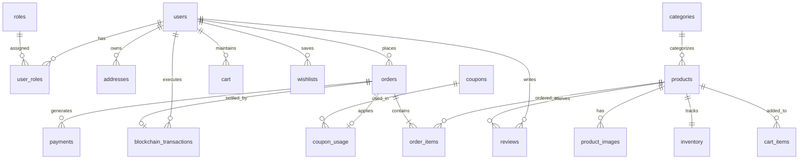

# NEXORA PostgreSQL Database Architecture

## 1. Overview
NEXORA utilizes PostgreSQL hosted on **InsForge** as its primary persistent storage engine. The schema contains 23 normalized tables, multiple performance indexes, foreign keys with referential actions, check constraints, and reporting views.

---

## 2. Table Directory & Entity Relationships



### Table Breakdown

| # | Table Name | Purpose | Primary Key | Critical Indexes |
|---|------------|---------|-------------|------------------|
| 1 | `users` | User accounts, profiles, wallet addresses | UUID (`gen_random_uuid()`) | `email`, `wallet_address` |
| 2 | `roles` | System authorization roles (`CUSTOMER`, `MANAGER`, `ADMIN`) | INT | `name (UNIQUE)` |
| 3 | `user_roles` | Many-to-many role assignments | `(user_id, role_id)` | Composite PK |
| 4 | `addresses` | Customer shipping and billing destinations | UUID | `user_id` |
| 5 | `categories` | Product taxonomy and icon descriptors | UUID | `slug (UNIQUE)` |
| 6 | `products` | Core catalog listings, pricing, ratings | UUID | `category_id`, `price`, `rating`, `sku` |
| 7 | `product_images` | High-res primary & gallery image assets | UUID | `product_id` |
| 8 | `inventory` | Physical stock, reserved stock, low threshold | UUID | `product_id (UNIQUE)`, `stock` |
| 9 | `cart` | Active persistent customer shopping session | UUID | `user_id (UNIQUE)` |
| 10 | `cart_items` | Products and line quantities in cart | UUID | `(cart_id, product_id)` UNIQUE |
| 11 | `wishlists` | User saved favorite collections | UUID | `user_id (UNIQUE)` |
| 12 | `wishlist_items` | Individual saved items | UUID | `(wishlist_id, product_id)` UNIQUE |
| 13 | `orders` | Completed checkout orders & fulfillment states | UUID | `order_number (UNIQUE)`, `user_id`, `status` |
| 14 | `order_items` | Historical line items captured at checkout | UUID | `order_id`, `product_id` |
| 15 | `payments` | Traditional & gateway payment records | UUID | `order_id`, `status` |
| 16 | `blockchain_transactions` | On-chain EVM crypto settlements | UUID | `transaction_hash (UNIQUE)`, `order_id` |
| 17 | `reviews` | Customer ratings, reviews, verified purchases | UUID | `(product_id, user_id)` UNIQUE |
| 18 | `coupons` | Promo codes, discount rules, expiry bounds | UUID | `code (UNIQUE)` |
| 19 | `coupon_usage` | Tracking redemptions per user & order | UUID | `(coupon_id, order_id)` UNIQUE |
| 20 | `notifications` | In-app alerts and order dispatch notifications | UUID | `user_id`, `is_read` |
| 21 | `sessions` | Server-side user login sessions | VARCHAR | `expires_at` |
| 22 | `audit_logs` | Audit trail of database state modifications | UUID | `user_id`, `action`, `created_at` |
| 23 | `mcp_audit_logs` | Telemetry log of all AI agent MCP tool calls | UUID | `tool_name`, `created_at` |

---

## 3. Database Views

1. **`v_product_catalog`**: Pre-joins products, categories, primary images, and current inventory stock for fast catalog querying.
2. **`v_low_stock`**: Automatically detects products whose stock has dropped to or below their safety threshold.
3. **`v_sales_analytics`**: Aggregates daily order volumes, gross revenue, and paid sales for analytics dashboards.

---

## 4. ACID Transaction Mechanics

Order placement executes inside an atomic PostgreSQL transaction:
```sql
BEGIN;
-- 1. Lock rows to prevent concurrent overselling
SELECT product_id, stock FROM inventory WHERE product_id = ANY($1) FOR UPDATE;

-- 2. Verify stock and calculate totals server-side
-- 3. Insert order record
INSERT INTO orders (...) VALUES (...);

-- 4. Insert order line items
INSERT INTO order_items (...) VALUES (...);

-- 5. Atomically decrement warehouse stock
UPDATE inventory SET stock = stock - $1 WHERE product_id = $2;

-- 6. Record payment
INSERT INTO payments (...) VALUES (...);

-- 7. Clear user cart
DELETE FROM cart_items WHERE cart_id = $1;

COMMIT; -- If any step throws an error, ROLLBACK is triggered immediately
```
